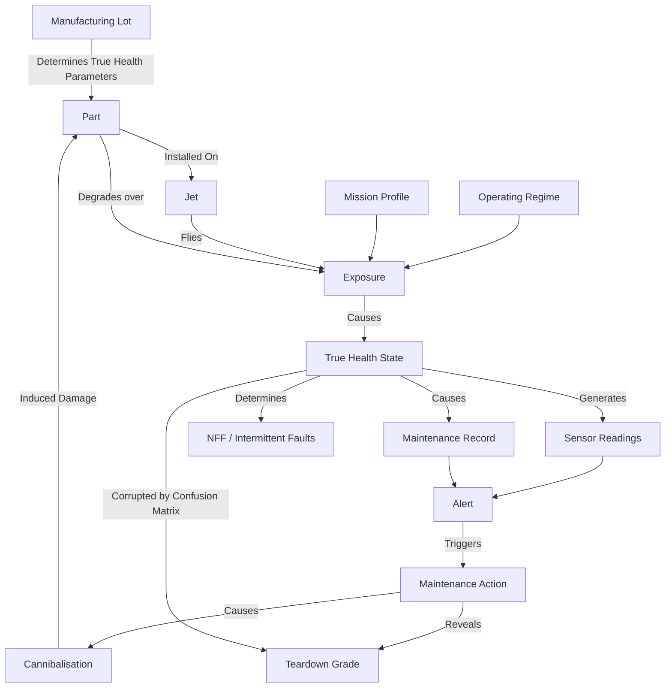

# Simulator: Structural Causal Model

This document defines the causal graph and mechanisms generating synthetic fleet data. The simulator acts as a frozen referee and generates separate observed event streams and unobserved ground truth.

## 1. Causal Graph

## 2. Entities & Mechanisms

### 2.1 Fleet & Geography
- **24 Jets** operating out of 2 Bases (Base A, Base B).
- **1 Regional Depot** (Depot D) providing heavy maintenance and central spares.

### 2.2 Parts & Failure Modes
Each jet has 8 critical parts divided into two classes:
- **Wear-out (4 parts)**: e.g., engine starter, hydraulic pump. Modeled via Weibull distribution with shape `k > 1` (hazard increases over time).
- **Random (4 parts)**: e.g., radar module, mission computer. Modeled via exponential distribution (Weibull shape `k ≈ 1`, constant hazard).

### 2.3 Manufacturing Lots (The Hidden Confounder)
- Parts belong to lots.
- **One hidden lot has an elevated failure rate (scale parameter scaled down).** This is a key confounder the Belief Engine and Demo modules must discover (Lot Contagion).

### 2.4 Operations & Exposure
- Daily sorties based on **Mission Profiles** (CAS, CAP), which require specific subsets of parts to be functional.
- **Operating Regimes** (Normal, Hot-Dusty, Surge-High-G) act as covariates, accelerating the wear-out (scaling the hazard).

### 2.5 Maintenance & Multi-Echelon Spares
- **Bases** have finite maintenance bays.
- **Depot** has a test bench for NFF evaluation and teardown grading.
- **Spares Network**: Base Spares → Depot Spares → OEM. Procurement takes time (lognormal lead times).
- **Cannibalisation**: If a part is urgently needed, it can be scavenged from a grounded jet. This carries an **induced-damage probability** (immediate drop in true health).

### 2.6 Observations (No C-MAPSS)
- **Sensors**: Synthetic degradation curves with added noise, bias, and stuck-faults.
- **Records**: Synthetic text debriefs (using templates with abbreviations) and corruptions (copy-paste errors, wrong part ID).
- **NFF**: Intermittent faults triggered stochastically depending on true health, leading to No Fault Found (NFF) outcomes at the test bench.
- **Teardown Grade**: A grade {1, 2, 3, 4} assigned at the depot, corrupted by a known **Confusion Matrix** against the true health state.

## 3. Interfaces
- `run(config, seed, world) -> (List[Event], GroundTruth)`
- `config`: Defines parameters (Weibull shape/scale per part type, lead times, lot multiplier).
- `world`: A toggle allowing counterfactual runs (e.g., twin-world: world A applies alerts, world B ignores alerts).
